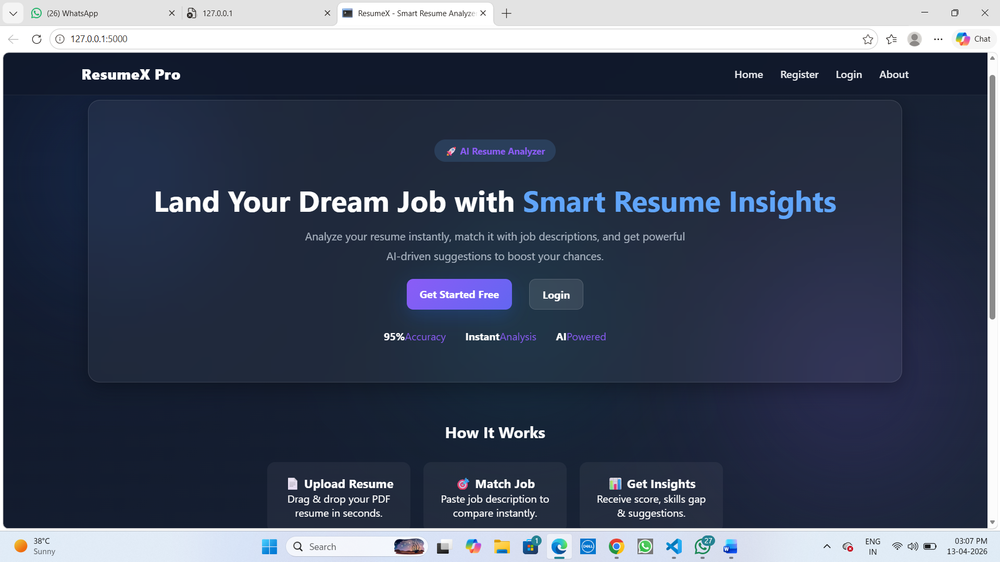
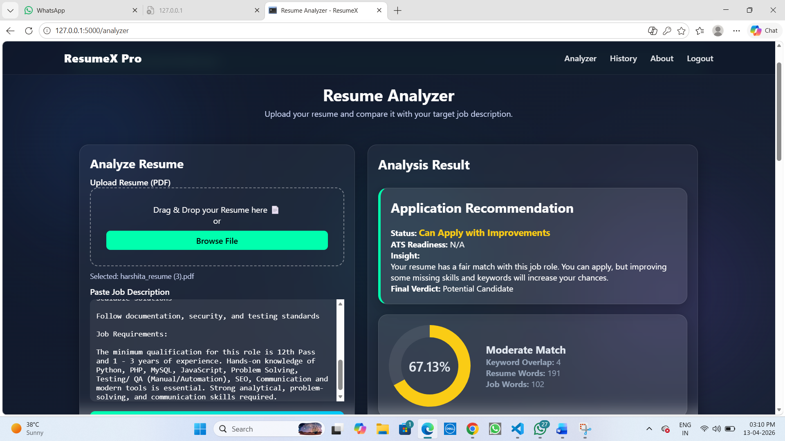
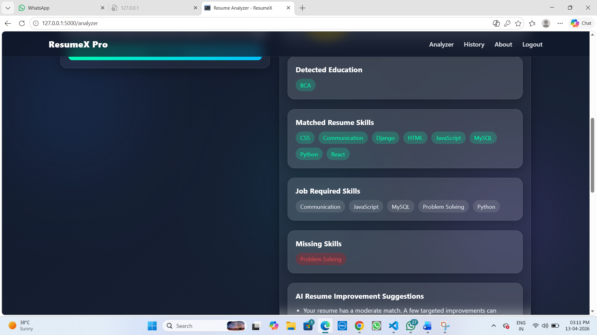
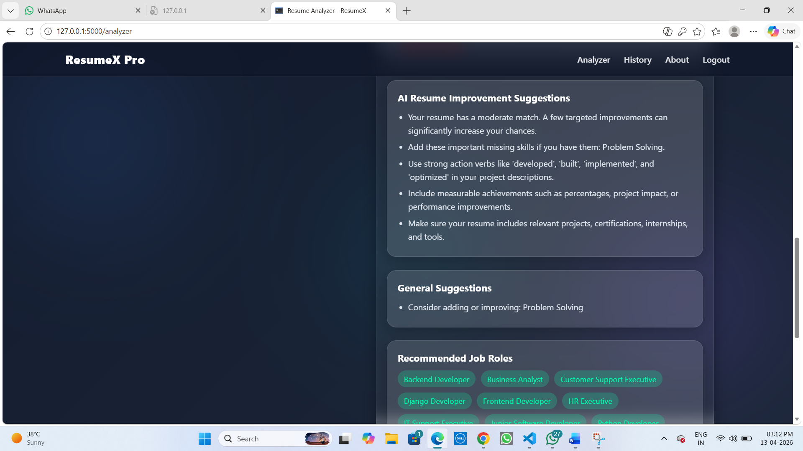
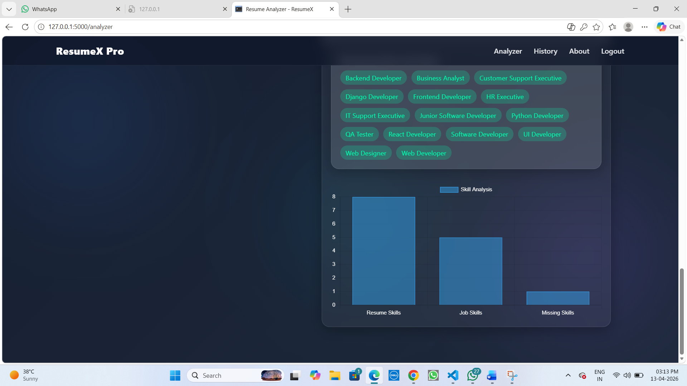
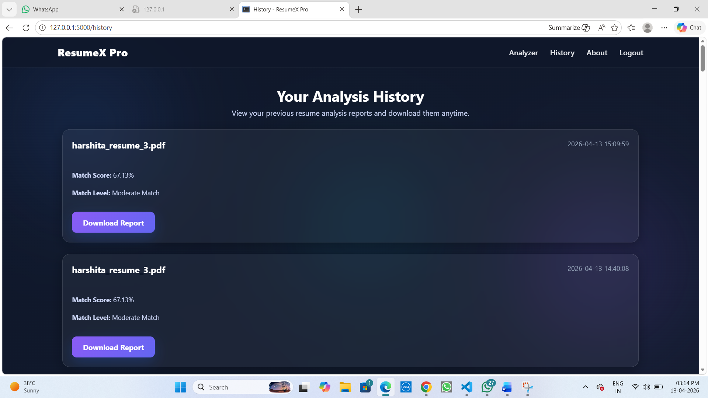

# 🚀 ResumeX Pro - AI Resume Analyzer

ResumeX Pro is a smart AI-powered web application that analyzes resumes against job descriptions and provides insights to improve your chances of getting hired.

---

## 🔥 Features

- 📄 Upload Resume (PDF)
- 🎯 Match Resume with Job Description
- 📊 ATS Score & Match Percentage
- 🧠 Skill Gap Detection
- 💡 AI-Powered Suggestions
- 📈 Visual Charts (Skills Analysis)
- 📜 Downloadable Report
- 🕘 Resume Analysis History
- 🔐 Secure Login System (Password Hashing)

---

## 🛠️ Tech Stack

- **Frontend:** HTML, CSS, JavaScript
- **Backend:** Python (Flask)
- **Charts:** Chart.js
- **Storage:** JSON (for demo purposes)

---

## 📸 Screenshots

### 🏠 Landing Page


### 📊 Analyzer Page
     

### 📜 History Page


---

## ⚙️ Installation & Setup

1. Clone the repository:
```bash
git clone https://github.com/your-username/ResumeX-Flask.git
cd ResumeX-Flask
